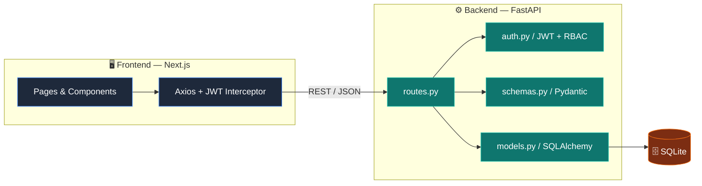
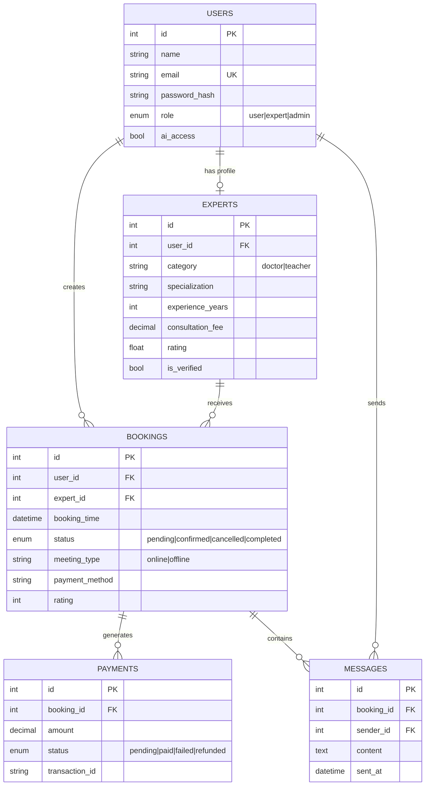
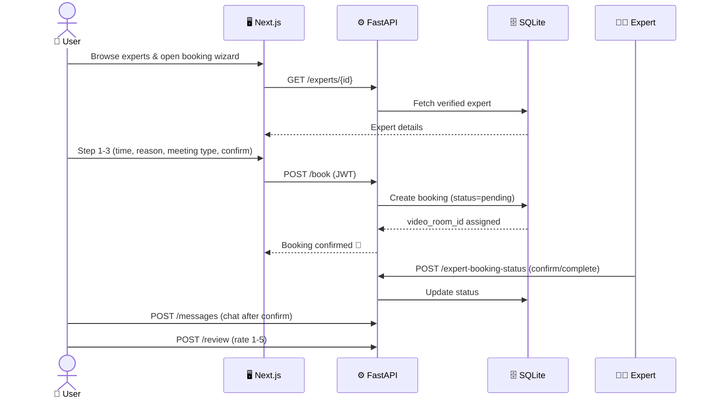
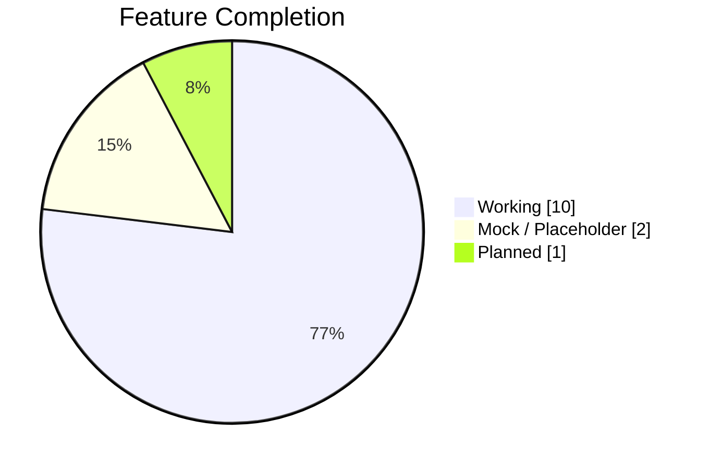
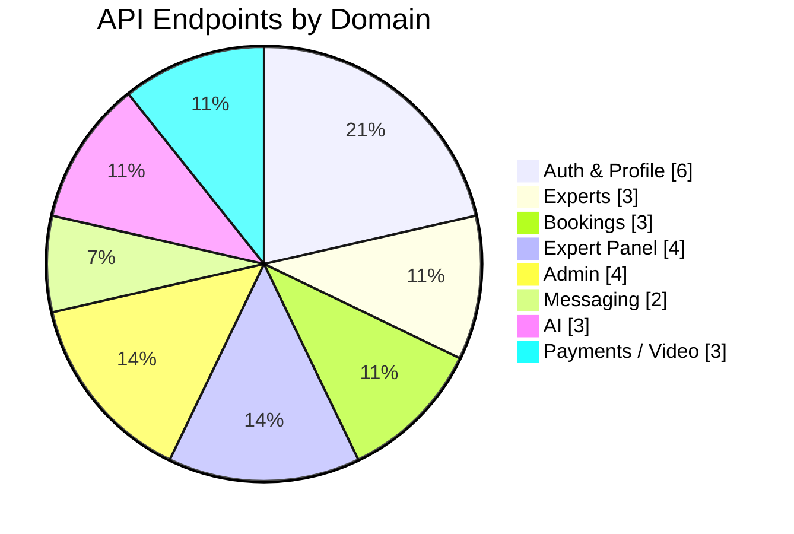

<div align="center">

# 🧭 Saarthi Consultancy

### _Your guide to the right expert — book doctors & teachers, chat with an AI, all in one place._

<p>
  
  
  
  
  
  
  
  
</p>

<p>
  
  
  
  
</p>

</div>

---

## 📋 Table of Contents

- [Overview](#-overview)
- [Tech Stack](#-tech-stack)
- [System Architecture](#-system-architecture)
- [Data Model (ERD)](#-data-model-erd)
- [Booking Flow](#-booking-flow)
- [Features by Role](#-features-by-role)
- [Feature Status](#-feature-status)
- [Project Stats](#-project-stats)
- [API Reference](#-api-reference)
- [Project Structure](#-project-structure)
- [Getting Started](#-getting-started)
- [Default Credentials](#-default-credentials)
- [Roadmap](#-roadmap)
- [Contributing](#-contributing)
- [License](#-license)

---

## 🚀 Overview

**Saarthi Consultancy** is a full-stack consultation marketplace that connects users with verified **doctors** and **teachers**. Users browse experts, book online or in-person sessions through a multi-step wizard, message their expert after booking, and get instant help from a built-in AI assistant. Experts manage their own workspace, and admins verify experts and oversee the whole platform.

> **Saarthi** (सारथी) means _"charioteer / guide"_ — the platform that steers you to the right expert. 🧭

```
┌──────────────┐      JWT / REST      ┌──────────────┐      SQLAlchemy ORM      ┌──────────────┐
│   Next.js    │  ───────────────────▶│   FastAPI    │  ──────────────────────▶ │    SQLite    │
│  (Frontend)  │ ◀─────────────────── │  (Backend)   │ ◀──────────────────────  │  (Database)  │
└──────────────┘      JSON            └──────────────┘                          └──────────────┘
```

---

## 🧰 Tech Stack

| Layer | Technology | Notes |
|------|-----------|-------|
| **Frontend** | Next.js 16 (App Router), React 19 | File-based routing, client components |
| **Styling** | Tailwind CSS 4 | Glassmorphism, gradients, `rounded-2xl`, CSS animations |
| **HTTP Client** | Axios | Interceptor injects JWT from `localStorage` |
| **Backend** | FastAPI 0.138 | Async-ready REST API + auto OpenAPI docs |
| **ORM** | SQLAlchemy 2.0 | Typed `Mapped[...]` models |
| **Database** | SQLite | Drop-in upgradeable to PostgreSQL via `DATABASE_URL` |
| **Auth** | JWT (`python-jose`) + `passlib`/`bcrypt` | Role-based access control (RBAC) |
| **Validation** | Pydantic 2 | Request/response schemas |
| **AI** | Rule-based engine | Keyword intent matching (LLM-ready) |

---

## 🏗 System Architecture



---

## 🗃 Data Model (ERD)



---

## 🔄 Booking Flow



---

## ✨ Features by Role

### 👥 User
- 🔐 Sign up / sign in (JWT)
- 🔎 Browse & filter verified experts (doctors / teachers)
- 🧙 Multi-step booking wizard — reason, urgency, language, **online video** or **in-person clinic**
- 📊 Dashboard with upcoming appointments
- 💬 Post-booking messaging with the expert
- ⭐ Rate & review completed consultations
- 🤖 AI assistant for instant guidance

### 👨‍⚕️ Expert
- 📝 Specialized registration (starts in **Pending Approval**)
- 🧰 Expert workspace: total bookings, completed sessions, earnings, avg rating
- 📅 Appointment management (`pending → confirmed → completed`)
- 👤 Editable profile (category, specialization, fee, experience, bio)

### 🛡️ Admin
- 📈 Platform overview (users, experts, bookings, revenue)
- ✅ Expert verification queue (one-click approve)
- 📒 Master booking ledger across the entire platform

### 🤖 AI Assistant
- Animated canvas **AI orb** (`AICharacter.jsx`) with idle / thinking / speaking states
- Rule-based intent engine for booking help + general topics (career, health, study, finance…)
- Designed to be swappable with a real LLM

---

## 📊 Feature Status

| Module | Endpoint(s) | Status |
|--------|-------------|--------|
| Authentication (register / login / JWT) | `/register`, `/login`, `/me` | ✅ Working |
| Expert registration & verification | `/register/expert`, `/admin/approve-expert` | ✅ Working |
| Expert directory | `/experts`, `/experts/{id}` | ✅ Working |
| Booking creation & listing | `/book`, `/my-bookings` | ✅ Working |
| Expert panel (stats / bookings / status) | `/expert-stats`, `/expert-bookings`, `/expert-booking-status` | ✅ Working |
| Profiles (user & expert) | `/profile`, `/profile/user`, `/profile/expert` | ✅ Working |
| Messaging | `/messages`, `/messages/{id}` | ✅ Working |
| Reviews & ratings | `/review` | ✅ Working |
| Admin dashboard & ledger | `/admin/*` | ✅ Working |
| AI assistant | `/ai-help`, `/ai-chat`, `/unlock-ai` | ✅ Working (rule-based) |
| Online payments | `/create-order`, `/verify-payment` | 🟡 Mock (UI uses cash) |
| Video calls | `/video-token` | 🟡 Mock token (no WebRTC yet) |
| DB migrations (Alembic) | — | 🔴 Not set up (`create_all`) |

**Legend:** ✅ Production-ready · 🟡 Mock / placeholder · 🔴 Planned

---

## 📈 Project Stats

### Feature completion



### Endpoint distribution by domain



---

## 📡 API Reference

> Interactive docs available at **`http://localhost:8000/docs`** (Swagger UI) once the backend is running.

| Method | Path | Auth | Description |
|--------|------|------|-------------|
| `POST` | `/register` | — | Register a user |
| `POST` | `/register/expert` | — | Register an expert (pending approval) |
| `POST` | `/login` | — | Login, returns JWT + role |
| `GET` | `/me` | 🔐 | Current user info |
| `GET` | `/experts` | — | List verified experts (`?category=`) |
| `GET` | `/experts/{id}` | — | Expert profile |
| `POST` | `/book` | 🔐 | Create a booking |
| `GET` | `/my-bookings` | 🔐 | User's bookings |
| `GET` | `/expert-stats` | 🔐 Expert | Expert dashboard stats |
| `GET` | `/expert-bookings` | 🔐 Expert | Expert's bookings |
| `POST` | `/expert-booking-status` | 🔐 Expert | Update booking status |
| `GET`/`PUT` | `/profile`, `/profile/user`, `/profile/expert` | 🔐 | View / update profile |
| `POST`/`GET` | `/messages`, `/messages/{id}` | 🔐 | Send / list messages |
| `POST` | `/review` | 🔐 | Submit a rating |
| `POST` | `/ai-help` | — | Rule-based help & booking intent |
| `POST` | `/ai-chat` | 🔐 + `ai_access` | Topic-based AI chat |
| `POST` | `/unlock-ai` | 🔐 | Grant AI access |
| `GET` | `/admin/dashboard-stats` | 🔐 Admin | Platform stats |
| `GET` | `/admin/pending-experts` | 🔐 Admin | Verification queue |
| `POST` | `/admin/approve-expert` | 🔐 Admin | Approve expert |
| `GET` | `/admin/bookings` | 🔐 Admin | Master booking ledger |
| `POST` | `/create-order`, `/verify-payment` | 🔐 | Payment (mock) |
| `GET` | `/video-token` | 🔐 | Video token (mock) |

---

## 📁 Project Structure

```
Saarthi_Consultancy/
├── backend/                  # FastAPI application
│   ├── main.py               # App entrypoint, CORS, exception handler
│   ├── routes.py             # All API routes
│   ├── models.py             # SQLAlchemy ORM models
│   ├── schemas.py            # Pydantic request/response schemas
│   ├── auth.py               # JWT + password hashing + RBAC
│   ├── database.py           # Engine, session, DB URL resolution
│   ├── seed_experts.py       # Seeds 10 demo experts
│   ├── seed_admin.py         # Creates / promotes the admin account
│   └── requirements.txt
├── frontend/                 # Next.js application
│   ├── app/                  # App Router pages (admin, ai, booking, dashboard…)
│   ├── components/           # Navbar, ChatBot, ExpertCard, AICharacter
│   ├── lib/api.js            # Axios instance + JWT interceptor
│   └── package.json
├── PROJECT_CONTEXT.md        # Living design/context doc
└── README.md
```

---

## ⚡ Getting Started

### Prerequisites
- **Python 3.11+**
- **Node.js 18+** and npm
- **Git**

### 1️⃣ Clone

```bash
git clone https://github.com/amangovindrao/Saarthi_Consultancy.git
cd Saarthi_Consultancy
```

### 2️⃣ Backend setup

```bash
# From the project root
python -m venv .venv
.venv\Scripts\activate          # Windows (PowerShell/CMD)
# source .venv/bin/activate     # macOS / Linux

pip install -r backend/requirements.txt

# (Optional) seed demo experts
python -m backend.seed_experts

# Create the default admin account
python -m backend.seed_admin

# Run the API (http://localhost:8000, docs at /docs)
uvicorn backend.main:app --reload
```

### 3️⃣ Frontend setup

```bash
cd frontend
npm install

# Optional: point the frontend at a non-default backend
# echo NEXT_PUBLIC_BACKEND_URL=http://localhost:8000 > .env.local

npm run dev      # http://localhost:3000
```

> 💡 The backend auto-creates tables on startup (`Base.metadata.create_all`). The default DB is `sqlite:///./consultant_ai.db`. Override with the `DATABASE_URL` env var (e.g. PostgreSQL) for production.

---

## 🔑 Default Credentials

After running `python -m backend.seed_admin`:

| Role | Email | Password |
|------|-------|----------|
| **Admin** | `admin@example.com` | `admin123` |
| **Demo experts** (from `seed_experts`) | e.g. `aarav.sharma@example.com` | `password123` |

> Override admin defaults with env vars: `ADMIN_EMAIL`, `ADMIN_PASSWORD`, `ADMIN_NAME`.
> The seed script is **idempotent** — re-running it promotes an existing user to admin and resets the password.

⚠️ **Change these before any public deployment.** Also set a strong `JWT_SECRET_KEY` env var (defaults to a placeholder).

---

## 🗺 Roadmap

- [ ] 🔌 Re-integrate a real payment gateway (Razorpay) with correct payload keys
- [ ] 📹 Real video calls (Jitsi / Daily.co / Twilio + WebRTC)
- [ ] 🧠 Swap rule-based AI for an LLM (OpenAI / Gemini) + Hinglish STT/TTS
- [ ] 🗂 Alembic migrations
- [ ] 🖼️ Profile avatars & document sharing (S3 / Cloudinary)
- [ ] 📧 Email/SMS notifications (FastAPI BackgroundTasks / Celery)
- [ ] 🐘 Migrate SQLite → PostgreSQL for production
- [ ] ☁️ Deploy (Vercel for FE, container/VM for BE)

---

## 🤝 Contributing

Contributions are welcome! 

1. Fork the repo
2. Create a feature branch: `git checkout -b feature/amazing-thing`
3. Commit your changes: `git commit -m "feat: add amazing thing"`
4. Push the branch: `git push origin feature/amazing-thing`
5. Open a Pull Request

---

## 📄 License

Released under the **MIT License**. See [`LICENSE`](LICENSE) for details.

---

<div align="center">

**Built with ❤️ for better healthcare & education.**

⭐ _If this project helped you, consider giving it a star!_ ⭐

</div>
